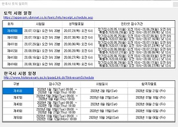

# Korean_history-TOEIC-reminder
>웹 크롤링을 이용한 한국사 토익 시험일정 프로그램

## 개발기간
* 2020.06.19.

## 주요기능
* 한국사와 토익의 시험 일정 정보를 웹에서 크롤링하여 출력
* 해당 웹에 최신으로 갱신되고, 그 정보를 자동으로 가져오므로 최신 시험 일정 유지 가능
    * 단, 알림 기능은 없음.

## Development setup
* 프레임워크: .Net 4.7.2
* 라이브러리: C#의 HtmlAgilityPack

## Release History

* 1.2.0
    * doc: Edit README.md to include a program image size 300pixel
    * README.md 내용 수정

* 1.2.0
    * forth
    * 셀 내용 변경 불가로 수정

* 1.1.0
    * third
    * 창 버튼 및 크기 조절 수정

* 1.0.0
    * first commit
    * 개발 완료

## Contact

김준혁 – kimjunhyeok.it@gmail.com
